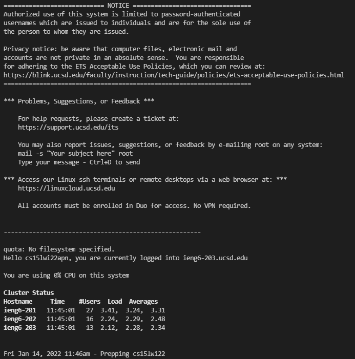
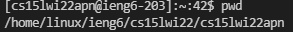
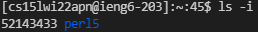
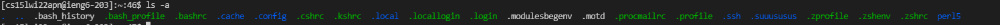
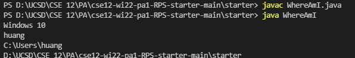
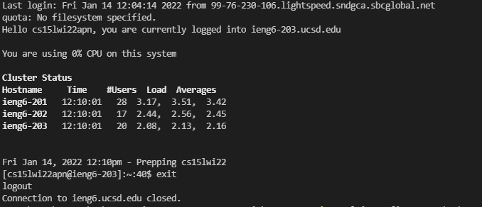
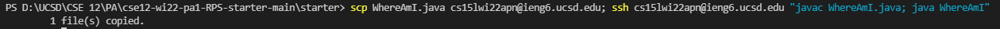

# Lab report for week 1-2

## Installing VScode
* becasue I took CSE11 last quarter, VScode was installed in advance
* Here's the link to download the [VScode](https://code.visualstudio.com/).

## Remotely Connecting

* I download and Installed [OpenSSH](https://docs.microsoft.com/en-us/windows-server/administration/openssh/openssh_install_firstuse) (The link that helped you to Install OpenSSH)
* Find my course-specific account for CSE15L
* I entered the command like this `ssh cs15lwi22apn@ieng6.ucsd.edu`
and successfully connected to the server!

## Trying Some Commands

* The command `pwd` prints the current working directory.
* The command `ls -i` lists the index number of each file.
* The command `ls -a` prints out all files in the current directory.
* The command `exit` will let me logout of the server.

## Moving Files with scp

* Create a file called `WhereAmI.java`
* I run the command `scp` in the terminal and it said i file copied
* I run on the client, and it works

## Setting an SSH Key

* type the command `ssh-keygen` and follow the instructions.
* Windows computer should follow the extra [ssh-add stpes](https://docs.microsoft.com/en-us/windows-server/administration/openssh/openssh_keymanagement#user-key-generation)
* Open the powershell and complete the extra steps
* after finished, I can copy without entering my password

## Optimizing Remote Running

* This command will first send a copy of the file to the server, then logs into the server, and execute the javac and java command in the same line. which saves a lot of work. 

