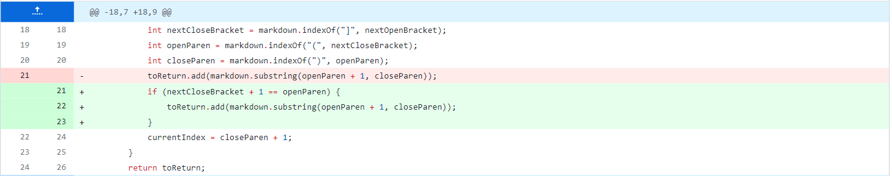
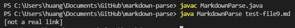
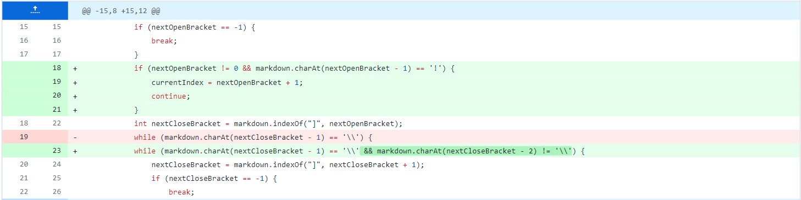
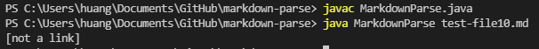
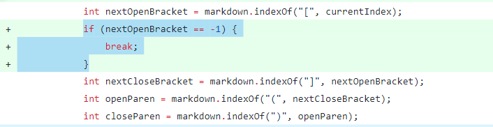
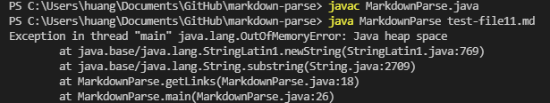

# Lab report for week 3-4
---
## First Code Change
* screenshot of the first code change

* Here's [A Link to the test file](https://2680991462.github.io/cse15l-lab-reports/test-file9.md)

* The code didn't consider the situation where the writer just want to use [] and () separately.
* The bug that caused this symptom is not checking if there's extra space between "](" that could cause them not to be a link.
* Therefore, From the screenshot above, we can see that it prints an output that are not supposed to be recognized as a Link ( there are words between "](" ).

---

## Second Code Change
* screenshot of the second code change

* Here's a [A Link to the test file](https://2680991462.github.io/cse15l-lab-reports/test-file10.md)

* The code didn't consider the situation where the writer just want insert a image instead of a link
* The bug that caused this symptom is not checking if there's a ! in front of the first [ that could change the line into a image instead of a link.
* Therefore, From the screenshot above, we can see that it prints an output that is a reference to an image, which should not be recognized as a Link.

## Third code Change
* screenshot of the third code change

* Here's a [A Link to the test file](https://2680991462.github.io/cse15l-lab-reports/test-file11.md)

* The code didn't consider the situation when there's no link in this file at all.
* The bug that caused this symptom is not checking if if the code can find the first OpenBracket
* when there's no Open Bracket, 'nextOpenBracket' will just be -1 and cause the while loop to run infinitely.
* Threfore, From the screenshot above, we can see that it caused a 'out of memory error'.

