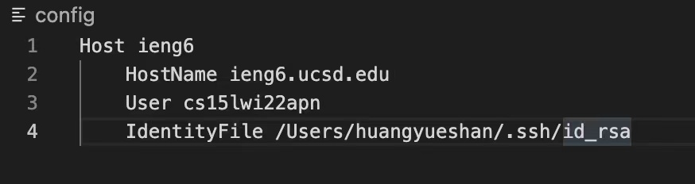
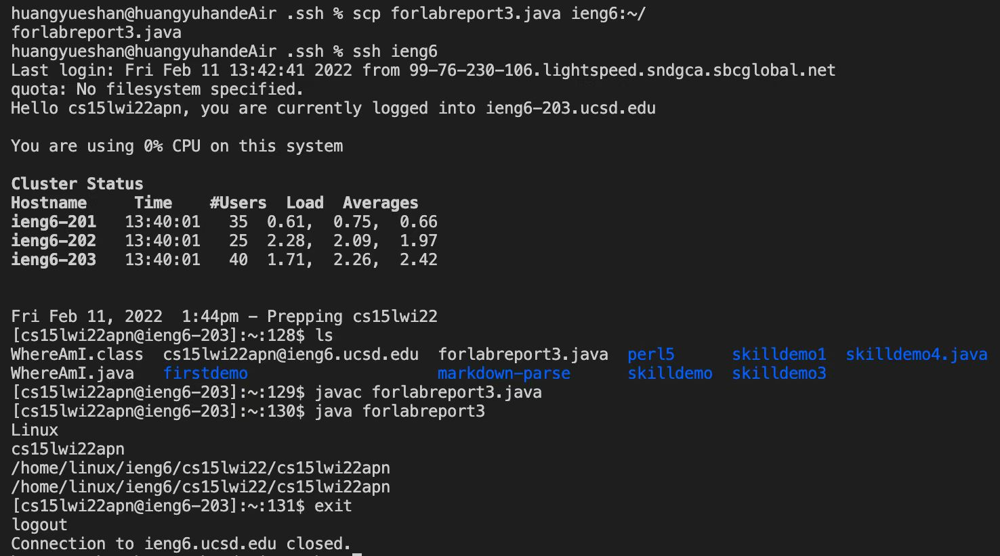
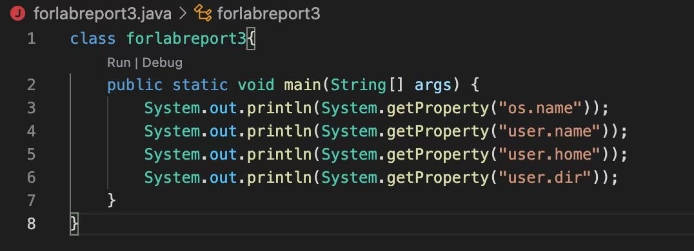

# Lab report for week 5-6
---
## Link to index
[Link to other lab report](https://2680991462.github.io/cse15l-lab-reports/index)
---
## My `.ssh/config` file

* The screenshot above is the config file I created.
* Here's the stepon how to create config file.
1. open the ".ssh" file using VScode and create a new file called "config".
2. copy and paste the code from week 5 lab tasks.
3. change the user name to my own user name.
4. add a line to refer to my ssh key file.

---
## The `ssh` command

* The screenshot above is the output after I typed `ssh ieng6` in the terminal.
* We can see that iI can login to my server without typing my username.

---
## The `scp` command

* The first screensho above is the output after I typed `scp forlabreport3.java ieng6:~/` in the terminal.
* The second screenshot is the file I moved to the remote server.
* Here's the step on how to copy the scp into the server.
1. create a java file called "forlabreport3" 
2. copy the code from week 1 lab taks
3. run the command `scp forlabreport3.java ieng6:~/`, which will copy the file to the server
4. run `javac` and `java` comand on the server and check if the code can run properly.
5. The output shows that the file runs on the ieng6 computer.

