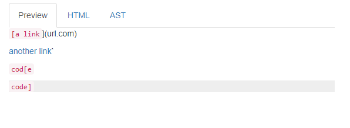
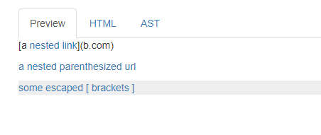
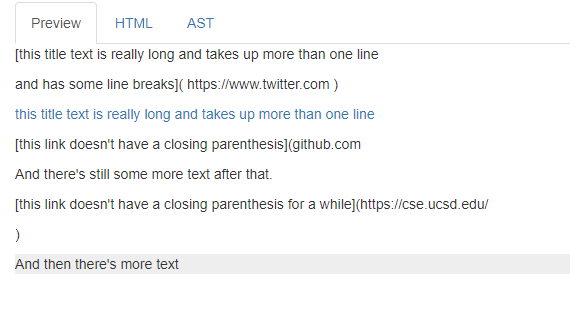
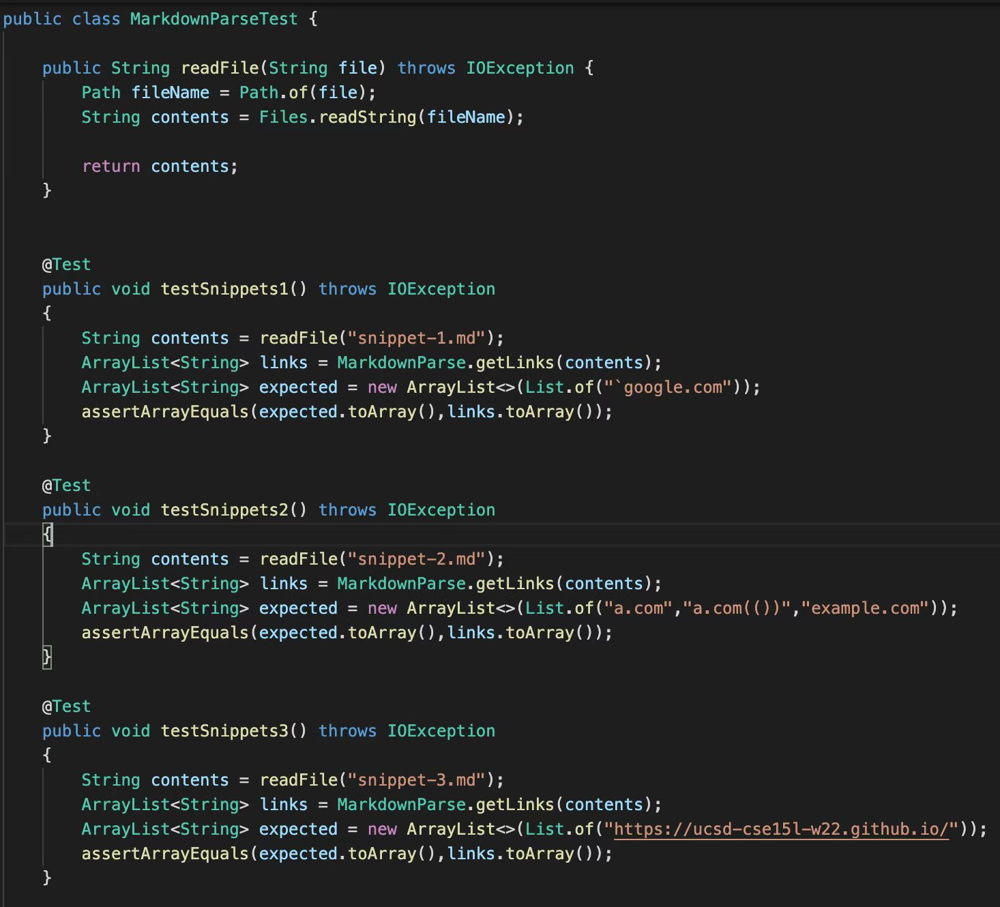
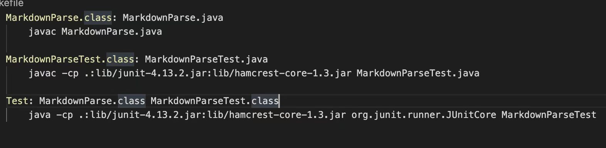
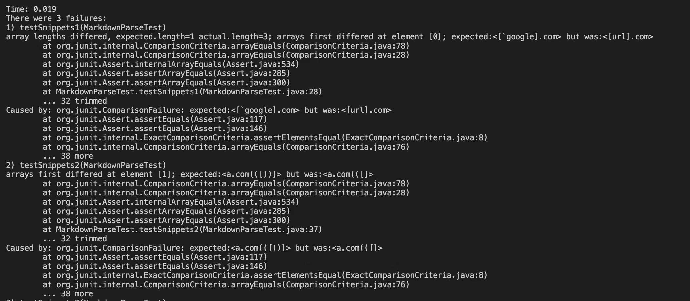
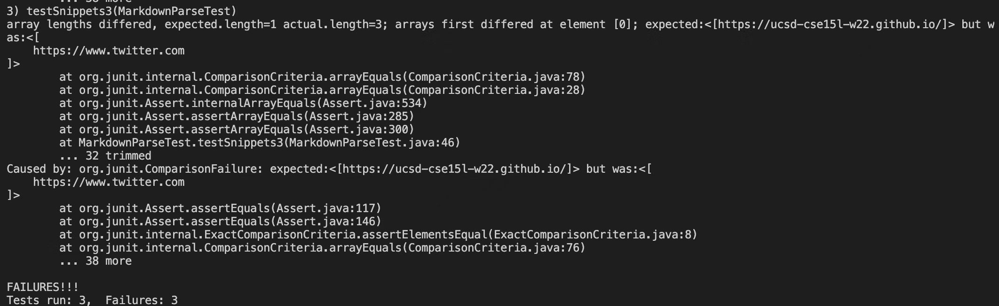
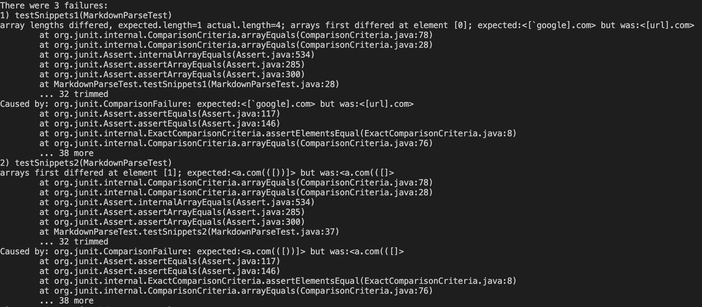
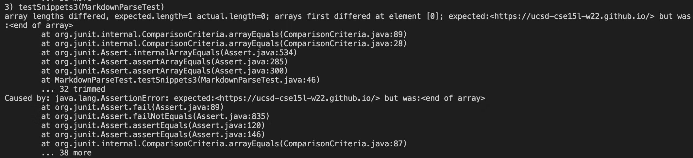

# Lab report for week 7-8

---
## Link to index
* [Link to other lab report](https://2680991462.github.io/cse15l-lab-reports/index)

---
## Link to the method
* [My markdown-parse repository](https://github.com/2680991462/markdown-parse-old)
* [reviewed markdown-parse repository](https://github.com/m1ma0314/markdown-parse)

---
## Preview of the Snippet

* The screenshot above is the preview of snippet 1. 
* Based on the result, it should produce the link "`google.com", "google.com", "ucsd.edu"

* The screenshot above is the preview of snippet 2. 
* Based on the result, it should produce links "a.com", "a.com(())", "example.com".

* The screenshot above is the preview of snippet 3. 
* Based on the result, it should produce the link "https://ucsd-cse15l-w22.github.io/"

---
## Test code

* The screenshot above is the code I used to test the three snippet.
* I created 3 tests and 1 make file to use on my markdownparse and the reviewed ones.

---
## My implementation

* The screenshot above is the output after I typed `make Test` using my own markdownparse
* The output shows that all three tests failed 
* The line `expected:<[google.com", "google.com", "ucsd.edu"> but was:<[url].com>` shows that my test case 1 failed
* The line `expected:<[a.com(([))]))> but was:<a.com(([]))>` shows that my test case 2 failed`
* The line `expected:<[http://ucsd-cse15l-w22.github.io/]> but was:<[https://twitter.com]` shows that my test case 3 failed

---
## reviewed implementation

* The screenshot above is the output after I typed `make Test` using the reviewed markdownparse
* The output shows that all three tests failed 
* The line `expected:<[google.com", "google.com", "ucsd.edu"> but was:<[url].com>` shows that my test case 1 failed
* The line `expected:<[a.com(([))]))> but was:<a.com(([]))>` shows that my test case 2 failed`
* The line `expected:<[http://ucsd-cse15l-w22.github.io/]> but was:<end of array>` shows that my test case 3 failed

---
## Answers to the Question
1. Yes, I believe there's a small code change that can make my program work for the snippet 1. I could just add a if statement to check if there's a inline code before the open brackets.
If there is, then the line should not considered as a link.

2. Yes, I believe there's a small code change that can make my program work for the snippet 2. I could add a simple method to check if the last character is a ")". if there's a matching problem like two ")" with one "(", it would require more difficult code using stack data structure.

3. No, I don't believe there's a small code change that can make my program work for the snippet 3. Because my code checks the link line by line and didn't consider the situation where links can be at different lines. This means I have to goo through my entire file to fix this error. 

