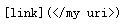
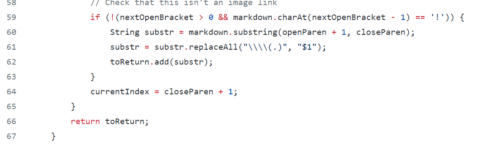
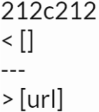
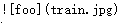
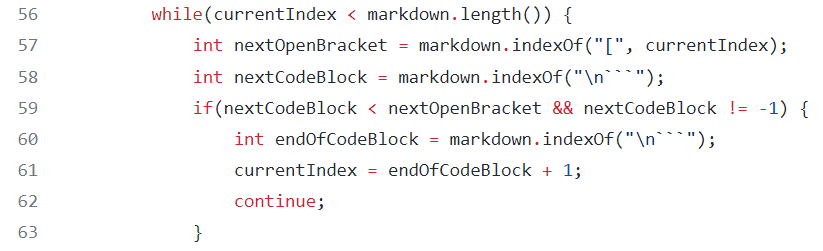

# Lab report for week 9-10

---
## Link to index
* [Link to other lab report](https://2680991462.github.io/cse15l-lab-reports/index)

---
## Tests with different results
* I did this diff check in lab 9
* I saved my output result using the command `bash script.sh > results-own.txt`
* I saved the output from the review implementation using the command `bash script.sh > results-review.txt`
* After I moved the two txt file into the same directory I used the command `diff results-own.txt results-review.txt`

---
## Test case 487

* This difference results from test case 488

* we can see that the correct output for this test cases should be `[]` becasue there's a sapce between the linka and should casue the link tobe invalid.
* My result is `[</my uri>]` which is incorrect but the reviewed implementation result is `[]`, which is correct

* The reason my code failed is becasue i didn't check if there's a space between the link
* Therefore, I can add a if statement to check if there's space between `(` and `)` 
* if there is I should consider this as a invalid link.

---
## Test case 577

* This difference results from test case 577

* we can see that the correct output for this test cases should be `[]` becasue this is not a link but a image.
* My result is `[]` which is correct but the reviewed implementation result is `[train.jpg]`, which is incorrect

* we can see from line 57 that this method didn't check if there's `!` infront of `[` 
* Therefore this method would recognize image as a link 
